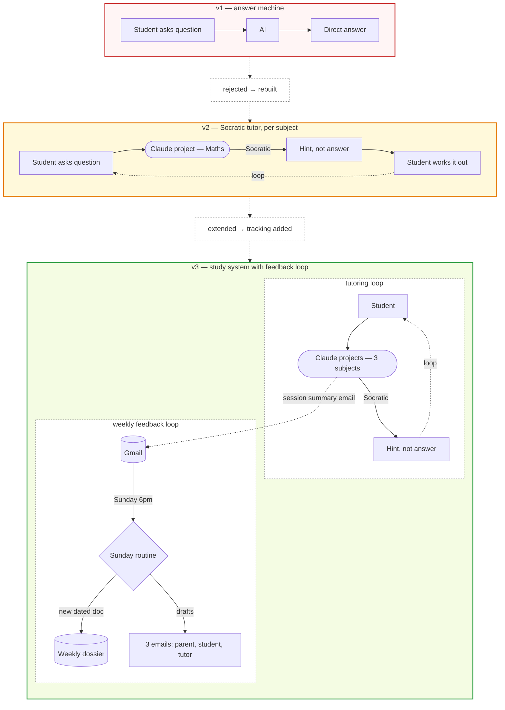

I spend my professional time shipping production AI agents on AWS for enterprise clients. Bedrock AgentCore, Strands, the integration layer between LLMs and the systems that actually matter. The work that does not show up in demo videos.

A few weeks ago I built an AI system for my Year 10 son. Not on AWS. Anthropic's Claude projects and Cowork routines, because the data lives in Google Workspace and the user is a teenager who needs a frictionless experience. Different stack, same architectural disciplines.

It took three iterations and one architecture pivot inside the third before it worked. What I did not expect was how cleanly the failure modes mapped to patterns I see in production Bedrock work. The five lessons below are the ones I will be taking straight back into client engagements.

## The build, briefly

Three subject-specific Claude projects with Socratic tutoring. A weekly Cowork routine that aggregates the week and produces three differentiated emails: a full dossier to me, a focused brief to each tutor, a forward-looking plan for him.

Cowork is Anthropic's scheduled-routine service for Claude. Think of it as cron for Claude projects, with built-in connectors to Gmail, Drive, and Calendar.

The architecture had to do two things: read what happened in the projects during the week, and produce structured output across multiple channels on a schedule. Sounds simple. Most agentic systems do.

## Three iterations, one architecture pivot

The version above is v3. There were two earlier shapes I had to rule out before I got there, and inside v3 there was a further pivot at the integration layer.

*Three iterations of the system. v1 was rejected, v2 was extended, v3 is the working build with its own internal architecture pivot.*

## v1: the answer machine

The first build was the obvious one. Ask Claude a question, get an answer. It worked on day one and failed the same week. He was not learning; he was copying. The pedagogical intent (that the system make him think) was nowhere in the design. I rebuilt.

## v2: Socratic tutor, per subject

v2 made the model refuse to give direct answers. One Claude project per subject, system prompts tuned to ask back rather than tell, hint at the next step rather than skip to the end. That worked. He had to actually do the maths. His tutors started commenting that the homework conversations were sharper.

The constraint we hit next was visibility. Three subjects across a week is a lot of context for a parent and three different tutors to absorb. We needed a layer on top that aggregated the week and split it for different audiences. That extension is what became v3.

## v3's first architecture failed at the integration layer

My first design for the v3 aggregation layer had the Sunday routine reading project chats directly and updating a rolling Google Doc. First real run: neither side worked. Cowork has no API surface to read project chats on the same account. The Drive connector is read-only for content. Two load-bearing assumptions, both wrong.

I have seen this exact pattern in Bedrock work. A team designs an agent that "queries the knowledge base, then updates the ticket." First deployment surfaces the truth: the knowledge base query returns chunks the agent cannot reason over, or the ticket system's API has a write surface that does not match the read surface. The system worked on paper because nobody tested the primitives in isolation.

## The architecture that works flips the data flow

The redesign inverted both directions. Each subject project now drafts a session-summary email at end-of-session with a fixed subject prefix. I review the draft and click Send. The Sunday routine searches Gmail by subject prefix instead of reading project chats. The routine creates a new dated doc each week instead of modifying an existing one.

Same intent. Different primitives. Push beats pull, and append beats mutate.

This is the same shift I keep recommending in Bedrock production work (see [Part 3 of the AgentCore series](/blog/part-3-strands-agent-sdk) where I walk through the same pattern with Strands tool calls). When an agent needs to "look inside" a system that cannot expose its state cleanly, the answer is almost always to make the producer emit, not to make the consumer introspect. Pull architectures have one failure mode for every integration. Push architectures have one failure mode total: the producer doesn't emit. That is debuggable.

## Five lessons that map directly to production AWS AI

**1. Verify the primitives before you design around them.** v3's first design cost me an evening because I drew a diagram before I tested whether Cowork could read project chats. Most failed Bedrock POCs I see fail for the same reason at a bigger scale: the team designs around assumed Knowledge Base behaviour, assumed AgentCore session state, assumed Strands tool-call semantics, without the kind of isolated [primitive testing](/blog/part-2-cdk-infrastructure-bedrock-agentcore) I'd insist on at the start of any CDK deployment. Save the diagram for after the smoke test.

**2. When introspection isn't possible, push beats pull.** This is the single most useful pattern I have learned this year. Half the production Bedrock work I do involves rearranging data flow from pull to push because the producer can be modified and the consumer cannot. If your agent needs to read state from a system that doesn't expose it cleanly, the right move is almost never a better retrieval strategy. It's an emit.

**3. Human-in-the-loop is a feature, not a bug.** v3 has me clicking Send on two emails per cycle. Ten seconds of human attention, full audit trail, kill switch on every outbound message. I argue for this on every enterprise engagement and lose half the time, because someone wants the autonomy metric. The teams that ship the human-in-the-loop version tend to still be running their agents six months later. The teams that skip it learn the value of an audit trail the hard way.

**4. Calibration windows beat go-live confidence.** Three Sunday runs on real data before flipping to multi-recipient. Same discipline I apply to Bedrock agents before they touch a customer-facing channel. Skipping calibration is the single biggest predictor of an enterprise AI rollback I have seen.

**5. The "things we got wrong" doc is more useful than the spec.** I now write a decision log on every client engagement, with the versions-that-didn't-work explicitly preserved. Six months later, when someone joins the project and asks "why is it built this way," that doc is the answer. The polished spec is for review committees. The decision log is for the team.

There is a sixth lesson, about the pedagogical move from v1 to v2, and what it taught me about scoping AI agents around *intent* rather than *output*. That one belongs in a separate post on when to graduate from Claude projects to AgentCore. It's in draft.

## Why I'm posting this on an AWS-focused blog

Because the lessons are stack-agnostic. AgentCore, Strands, Bedrock Knowledge Bases, Lambda-backed tools, plain old Claude projects with Cowork: the architectural disciplines are the same. The model layer is interchangeable. The integration layer is where production AI lives or dies. That's true on AWS, that's true on Anthropic's stack, and that's true on whatever comes next.

Side builds like this are how I sharpen patterns I then apply at scale to enterprise AWS engagements. Enterprise engagements take longer to write up because they have to be anonymised. Side builds let me publish the pattern faster.

## The repo

Full design history, the v1 and v2 specs, the v3 architecture that failed, the v3 architecture that works, the prompts, the build plan, and the calibration log are open-source: [github.com/rajmurugan01/study-loop](https://github.com/rajmurugan01/study-loop)

If you ship production AI on AWS and any of these patterns ring true, I would like to compare notes. Find me on [LinkedIn](https://www.linkedin.com/in/muruganraj/), or comment below.

More posts on production AWS AI: [browse the blog](/blog) or [subscribe by RSS](/rss.xml). The next post in this thread, on when to graduate from Claude projects to AgentCore, is in draft.
